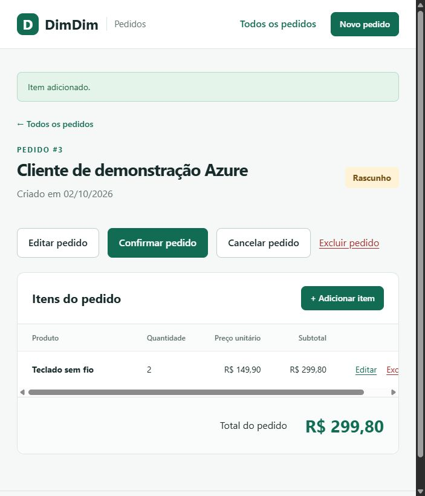

# Resultado da etapa 4

Implantação realizada em 2 de outubro de 2026, horário de São Paulo.

## Aplicação publicada

[Abrir DimDim Pedidos](https://dimdim-pedidos-261002-ce05.azurewebsites.net/pedidos).

## Recursos criados

| Recurso | Nome / configuração |
| --- | --- |
| Grupo | rg-dimdim-261002-ce05 |
| Região | Brazil South (brazilsouth) |
| Plano App Service | plan-dimdim-261002-ce05, Linux/F1 |
| Web App | dimdim-pedidos-261002-ce05 |
| Runtime | JAVA\|21-java21 |
| Servidor SQL | dimdim-sql-261002-ce05 |
| Banco | dimdim-pedidos, Basic |
| Tabelas | dbo.pedido e dbo.item_pedido |
| Usuário da aplicação | dimdim_app, somente CRUD nas duas tabelas |

Criados na assinatura de estudante autenticada do usuário. A configuração específica da assinatura fica em `.local/azure-config.json`, sem credenciais e fora do Git.

## Alterações no projeto

- `infra/Deploy-Azure.ps1`: plano sem execução por padrão e provisionamento/deploy via Azure CLI com `-Execute`.
- `infra/Common.ps1`: validação da configuração e funções auxiliares.
- `infra/azure.example.json`: modelo de configuração para reproduzir a implantação.
- `database/SqlSetup.java`: execução do DDL e configuração do usuário restrito.
- `AzureSqlIntegrationTest`: testes opcionais de CRUD e exclusão em cascata no banco real.
- `infra/Test-AzureDeployment.ps1`: verificação de Java 21, HTTPS, banco online e resposta da página publicada.
- `infra/Inspect-AzurePedido.ps1` e `database/SqlInspect.java`: consulta de um pedido e seus itens diretamente no Azure SQL, sem imprimir credenciais.
- `docs/implantacao-azure.md`: guia dos comandos, execução, retomada e validação.

As senhas foram geradas em memória e configuradas no serviço. O arquivo temporário de configurações foi removido. O código e os relatórios não contêm senhas.

## Verificações

1. Política da assinatura consultada: brazilsouth permitida.
2. Runtime JAVA:21-java21 confirmado no Azure CLI.
3. DDL executado no Azure SQL, com PK, FK, restrições e índice.
4. 44 testes locais aprovados. Os 2 testes Azure foram inicialmente ignorados por serem opcionais.
5. Os 2 testes Azure executados separadamente com conexão real: ambos aprovados, sem falhas nem erros. Eles confirmaram persistência após inserir/alterar/excluir e ON DELETE CASCADE na exclusão direta do pedido.
6. JAR publicado por `az webapp deploy --type jar`.
7. Web App verificado em estado Running, Java 21, HTTPS obrigatório e banco em estado Online, plano Basic.
8. Página `/pedidos` retornou a aplicação sem o aviso de demonstração temporária.
9. Pedido criado pela interface da aplicação na Azure e consultado diretamente por JDBC.

## Evidência do banco

Consulta do pedido fictício criado pela interface:

```text
Pedido 3 | Cliente: Cliente de demonstração Azure | Data: 2026-10-02 | Status: RASCUNHO
Item 3 | FK pedido_id: 3 | Produto: Teclado sem fio | Quantidade: 2 | Preço: 149.90 | Subtotal: 299.80
Total conferido no banco: 299.80
```

O pedido de demonstração foi mantido para revisão. Os registros dos testes automatizados foram removidos pelos próprios testes.



## Estado e limites

- Recursos continuam ativos. O banco Basic consome créditos da assinatura.
- O plano F1 possui limites de uso e pode ter inicialização a frio. Não houve mudança automática para um plano pago.
- A aplicação permanece sem login, conforme o escopo inicial.
- Firewall SQL liberado somente para o IPv4 identificado do computador e os IPs de saída possíveis do Web App.
- Mudanças de IP/rede podem exigir atualização das regras antes de consultas locais ou de mudanças na infraestrutura.
- A retomada do roteiro redefine as senhas dos recursos SQL deste grupo e atualiza a configuração; não exclui tabelas nem dados.
- A concorrência dos bloqueios requer teste específico, além do CRUD sequencial realizado.
- Não foi configurado Application Insights nem publicado repositório GitHub nesta etapa.

## Próxima etapa

Etapa 5: configurar Application Insights e comprovar o recebimento de telemetria. Aguardar autorização explícita antes de começar.
